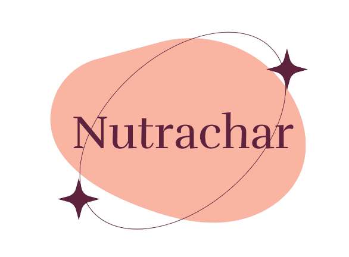

<div align="center">
  
  <h1>Nutrachar - Diet Macro Analyzer</h1>
  <p>
    A full-stack web application to track the macronutrients in your diet by uploading nutritional labels or entering data manually.
  </p>
  
  <!-- Badges -->
  <p>
    
    
    
        
    
  </p>
  
  <a href="https://nutrachar.vercel.app"><strong>View Live Demo »</strong></a>
</div>

<br>

<div align="center">
  
</div>

## ✨ Features

-   ✅ **AI-Powered OCR**: Upload images of nutritional labels and let Google's Gemini AI extract the data.
-   ✅ **Data Visualization**: See your macro distribution (proteins, carbs, fats) in a clear pie chart.
-   ✅ **Responsive Design**: A clean UI that works seamlessly on desktop and mobile.
-   ✅ **Full CRUD for Diets**: Create, Read, Update, and Delete your diet plans.
-   ✅ **User Authentication**: Secure user registration and login with JWT.
-   ✅ **Manual Data Entry**: Flexibility to add or edit food items manually.
-   ✅ **Dynamic Calculations**: Adjust food quantities and see total macros update in real-time.
-   ✅ **Recommended Ratios**: Compare your diet against recommended ratios for weight loss, maintenance, or muscle gain.

## 🛠️ Tech Stack

| Category      | Technology                                                                                             |
| :------------ | :----------------------------------------------------------------------------------------------------- |
| **Frontend**  | `React (Vite)` `Redux Toolkit` `React Router` `Tailwind CSS` `Axios` `React Hook Form` `Recharts`        |
| **Backend**   | `Express.js` `MongoDB (Mongoose)` `JWT` `bcrypt` `Google Gemini API` `Cloudinary` `Multer`               |
| **Deployment**| `Vercel` (for both frontend and backend)                                                                 |

## 📂 Project Structure

The project is organized into a monorepo structure with `frontend` and `backend` directories.

```
Nutrachar/
├── backend/
│   ├── src/
│   │   ├── controllers/    # Request/response handlers
│   │   ├── db/             # MongoDB connection
│   │   ├── middlewares/    # Express middlewares (auth, file upload)
│   │   ├── models/         # Mongoose schemas
│   │   ├── routes/         # API routes
│   │   └── utils/          # Utility functions (API responses, error handling, etc.)
│   └── vercel.json       # Vercel deployment config
│
└── frontend/
    ├── src/
    │   ├── components/     # Reusable React components
    │   ├── expressBackend/ # Services for API communication
    │   ├── pages/          # Page components
    │   ├── store/          # Redux Toolkit store and slices
    │   ├── App.jsx         # Main App component
    │   └── main.jsx        # Application entry point with routing
    ├── vite.config.js    # Vite configuration
    └── vercel.json       # Vercel deployment config
```

## 🚀 Getting Started - Run Locally 🖥️

### Prerequisites


-   Node.js and npm
-   API keys:  (as per .env sample in /backend folder)
-       MongoDB instance (local or cloud)
-       API keys for Cloudinary and Google Gemini

### 🖥️ Backend Setup

1.  Navigate to the `backend` directory:
    ```sh
    cd backend
    ```
2.  Install dependencies:
    ```sh
    npm install
    ```
3.  Create a `.env` file and add the necessary environment variables (e.g., `MONGODB_URI`, `CORS_ORIGIN`, `ACCESS_TOKEN_SECRET`, `GEMINI_API`, Cloudinary credentials).
4.  Start the development server:
    ```sh
    npm run dev
    ```

### 🌐 Frontend Setup

1.  Navigate to the `frontend` directory:
    ```sh
    cd frontend
    ```
2.  Install dependencies:
    ```sh
    npm install
    ```
3.  edit `vite.config.js` in Nutrachar/frontend with backend localhost url.
4.  Start the development server:
    ```sh
    npm run dev
    ```

The application will be available at `http://localhost:5173`. The Vite dev server will proxy API requests to the backend.

